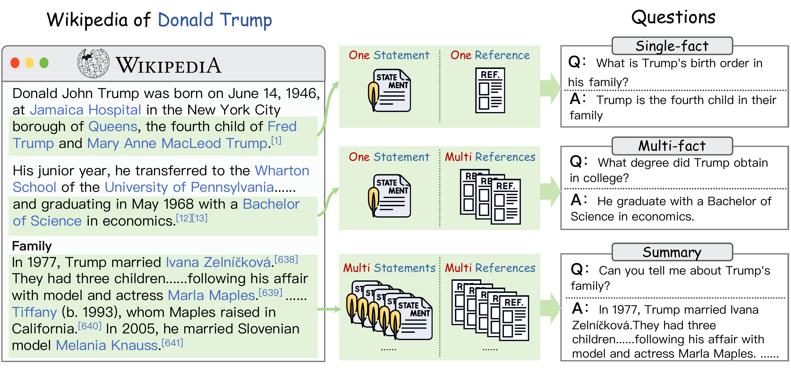
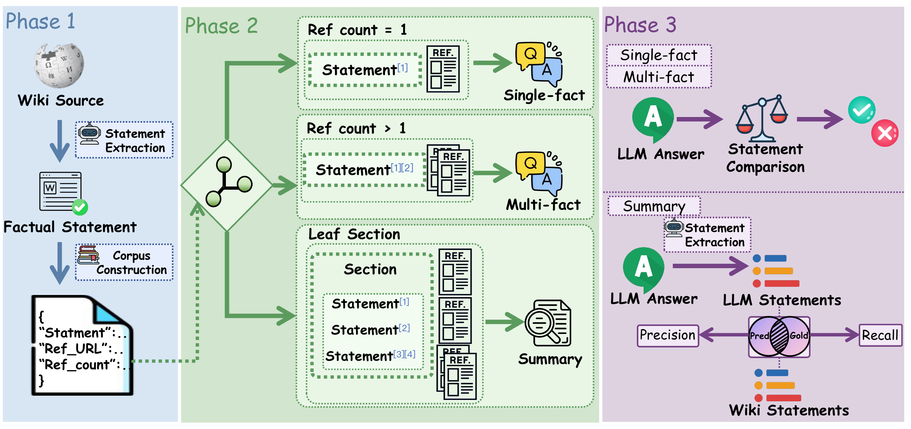

<div align="center">

# WildGraphBench

**Benchmarking GraphRAG with Wild-Source Corpora**

[](https://arxiv.org/abs/2602.02053)
[](LICENSE)
[](https://huggingface.co/datasets/YOUR_HF_LINK_HERE)

</div>

## 📰 News

- **Feb 2026**: Paper released on [arXiv](https://arxiv.org/abs/2602.02053)!

## 📖 Overview

**WildGraphBench** is a benchmark designed to evaluate Graph-based Retrieval-Augmented Generation (GraphRAG) systems in realistic, challenging scenarios. Unlike existing benchmarks that rely on short, curated passages, WildGraphBench uses Wikipedia's unique structure—where concise summaries are grounded in long, heterogeneous external reference documents—to create a truly "wild" evaluation setting.


### 🔑 Key Features

- **Wild Evidence**: External reference pages from Wikipedia, including news sites, blogs, PDFs, and public reports
- **12 Diverse Topics**: Culture, Geography, Health, History, Human Activities, Mathematics, Nature, People, Philosophy, Religion, Society, and Technology
- **1,197 Questions** across three complexity levels:
  - 🔹 **Single-Fact QA** (667 questions): Lookup-style questions grounded by a single reference
  - 🔹 **Multi-Fact QA** (191 questions): Questions requiring evidence aggregation across multiple references
  - 🔹 **Summary** (339 questions): Section-level summarization tasks evaluated at the statement level

### 📋 Task Examples



### 🔧 Benchmark Pipeline



---

## 📊 Main Results

We evaluate representative flat-RAG and GraphRAG baselines on WildGraphBench. All methods use `gpt-4o-mini` for graph construction and answering.

### Overall Performance

| Method | Avg. Acc. | Single-fact Acc. | Multi-fact Acc. | Recall | Precision | F1 |
|:-------|:---------:|:----------------:|:---------------:|:------:|:---------:|:--:|
| **NaiveRAG** | 59.79 | 66.87 | 35.08 | **13.54** | 19.07 | **15.84** |
| BM25 | 36.83 | 41.38 | 20.94 | 9.38 | 19.46 | 12.66 |
| Fast-GraphRAG | 33.56 | 35.83 | 25.65 | 6.81 | 23.48 | 10.56 |
| **HippoRAG2** | **64.33** | **71.51** | 39.27 | 11.15 | 16.76 | 13.39 |
| MS GraphRAG (local) | 38.23 | 39.43 | 34.03 | 9.82 | 12.64 | 11.05 |
| MS GraphRAG (global) | 54.54 | 56.52 | **47.64** | 12.66 | 15.13 | 13.78 |
| LightRAG (hybrid) | 56.76 | 61.32 | 40.84 | 12.44 | 17.70 | 14.61 |
| LinearRAG | 44.87 | 47.53 | 35.60 | 5.81 | **29.20** | 9.69 |

### 💡 Key Findings

1. **Single-Fact QA**: Flat retrieval baselines (NaiveRAG) remain competitive; graph structure doesn't automatically translate into gains for simple lookups
2. **Multi-Fact QA**: GraphRAG methods (especially MS GraphRAG global) show clear advantages when evidence must be aggregated from multiple documents
3. **Summary Tasks**: All methods struggle with low statement-level scores; NaiveRAG achieves highest recall due to broader context coverage, while GraphRAG bottlenecks may limit evidence gathering

---

## 📁 Dataset Statistics

### Question Distribution by Domain

| Domain | Single-Fact | Multi-Fact | Summary | Total |
|:-------|:-----------:|:----------:|:-------:|:-----:|
| Culture | 86 | 37 | 32 | 155 |
| Geography | 41 | 24 | 33 | 98 |
| Health | 76 | 19 | 55 | 150 |
| History | 25 | 1 | 10 | 36 |
| Human Activities | 83 | 13 | 44 | 140 |
| Mathematics | 21 | 1 | 11 | 33 |
| Nature | 18 | 0 | 10 | 28 |
| People | 77 | 32 | 45 | 154 |
| Philosophy | 46 | 6 | 18 | 70 |
| Religion | 72 | 4 | 30 | 106 |
| Society | 66 | 21 | 27 | 114 |
| Technology | 56 | 33 | 24 | 113 |
| **Total** | **667** | **191** | **339** | **1,197** |

---

## 📂 Repository Structure

```
WildGraphBench/
├── corpus/                     # Corpus for graph construction
│   └── {domain}/{topic}/
│       ├── {topic}.txt              # Wikipedia article (for reference only)
│       ├── reference_pages/         # 📌 Use these for graph construction!
│       └── references.jsonl         # Reference metadata
├── QA/                         # Questions for evaluation
│   └── {domain}/
│       └── questions.jsonl
├── statements/                 # Gold statements (for Summary tasks)
│   └── {domain}/{topic}/
│       └── statements.jsonl
└── LICENSE
```

---

## 🚀 Quick Start

WildGraphBench evaluates GraphRAG systems in **two steps**:

| Step | Task | Path |
|:----:|:-----|:-----|
| 1️⃣ | **Build Graph** from reference documents | `corpus/{domain}/{topic}/reference_pages/*.txt` |
| 2️⃣ | **Answer Questions** and evaluate | `QA/{domain}/questions.jsonl` |

> ⚠️ Build your graph from **reference pages**, not the Wikipedia article!

### Available Domains

| Domain | Topic | References | Questions |
|:-------|:------|:----------:|:---------:|
| `culture` | Marvel Cinematic Universe | 452 | 155 |
| `geography` | United States | 470 | 98 |
| `health` | COVID-19 pandemic | 510 | 150 |
| `history` | World War II | 74 | 36 |
| `human_activities` | 2022 FIFA World Cup | 367 | 140 |
| `mathematics` | Prime number | 50 | 33 |
| `nature` | 2012 Pacific typhoon season | 72 | 28 |
| `people` | Donald Trump | 547 | 154 |
| `philosophy` | Authoritarian socialism | 257 | 70 |
| `religion` | Persecution of Muslims | 346 | 106 |
| `society` | Human | 319 | 114 |
| `technology` | Steam (service) | 442 | 113 |

### Question Format

**Single-Fact / Multi-Fact:**
```json
{"question": "...", "question_type": ["single-fact"], "answer": "...", "ref_urls": ["..."]}
```

**Summary:**
```json
{"question": "...", "question_type": ["summary"], "gold_statements": ["...", "..."], "ref_urls": ["..."]}
```

### Evaluation

Use `tools/eval.py` to evaluate your predictions:

```bash
python tools/eval.py --gold QA/{domain}/questions.jsonl --pred your_predictions.jsonl --outdir results/
```

**Configuration** (set in `.env` or environment variables):

| Variable | Description | Default |
|:---------|:------------|:--------|
| `EVAL_API_KEY` | API key for LLM judge | - |
| `EVAL_BASE_URL` | API endpoint (OpenAI-compatible) | `https://api.openai.com/v1` |
| `EVAL_MODEL` | Model for evaluation | `gpt-5-mini` |

---

## 📝 Citation

If you find WildGraphBench useful in your research, please cite our paper:

```bibtex
@misc{wang2026wildgraphbenchbenchmarkinggraphragwildsource,
      title={WildGraphBench: Benchmarking GraphRAG with Wild-Source Corpora}, 
      author={Pengyu Wang and Benfeng Xu and Licheng Zhang and Shaohan Wang and Mingxuan Du and Chiwei Zhu and Zhendong Mao},
      year={2026},
      eprint={2602.02053},
      archivePrefix={arXiv},
      primaryClass={cs.CL},
      url={https://arxiv.org/abs/2602.02053}, 
}
```

---

## 📄 License

This project is licensed under the Apache License 2.0 - see the [LICENSE](LICENSE) file for details.

---

<div align="center">

**⭐ Star us on GitHub if you find this benchmark useful! ⭐**

</div>
